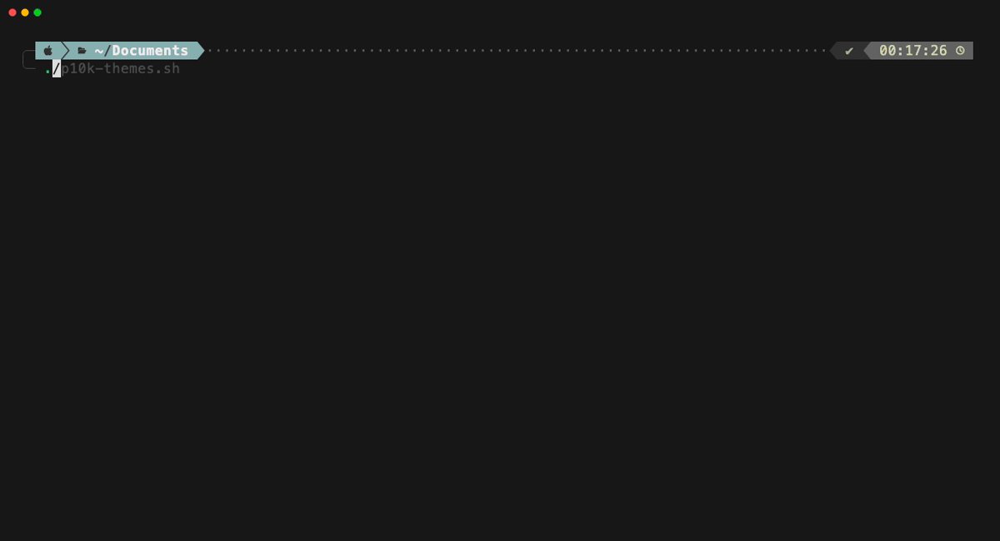

# p10k-themes

Apply popular terminal color themes to your [Powerlevel10k](https://github.com/romkatv/powerlevel10k) prompt with a single command.



One script. 20 themes. No layout changes — just colors.

## What it does

`p10k-themes` re-colors every segment of your Powerlevel10k prompt — left side, right side, git status, directory, execution time, and all inline VCS text — to match popular terminal color schemes. It only touches color values in your `~/.p10k.zsh`; layout, segments, icons, and behavior are left untouched.

Your original config is automatically backed up before any changes.

## Themes

| # | Theme |
|---|-------|
| 1 | Dracula |
| 2 | Catppuccin Mocha |
| 3 | Catppuccin Macchiato |
| 4 | Catppuccin Frappe |
| 5 | Catppuccin Latte |
| 6 | Nord |
| 7 | Gruvbox Dark |
| 8 | Gruvbox Light |
| 9 | Solarized Dark |
| 10 | Solarized Light |
| 11 | One Dark |
| 12 | Tokyo Night |
| 13 | Tokyo Night Storm |
| 14 | Monokai |
| 15 | Rose Pine |
| 16 | Rose Pine Moon |
| 17 | Kanagawa |
| 18 | Everforest Dark |
| 19 | Ayu Dark |
| 20 | Material Dark |

## Installation

```bash
git clone https://github.com/YOUR_USERNAME/p10k-themes.git
cd p10k-themes
chmod +x p10k-themes.sh
```

## Usage

```bash
# Interactive menu (uses fzf if available, falls back to numbered list)
./p10k-themes.sh

# List available themes
./p10k-themes.sh --list

# Apply a theme directly
./p10k-themes.sh --theme 1        # Dracula
./p10k-themes.sh --theme 6        # Nord

# Restore from backup
./p10k-themes.sh --restore

# Clear saved baseline (run after re-running p10k configure)
./p10k-themes.sh --reset-baseline

# Show help
./p10k-themes.sh --help
```

After applying a theme, run `exec zsh` to see the changes.

## How it works

1. **Baseline preservation** — On first run, your original `~/.p10k.zsh` is saved as a baseline. Every theme is applied from this clean starting point, so switching themes never compounds changes.

2. **Global ANSI palette swap** — All FOREGROUND/BACKGROUND values using standard ANSI codes (0-8) are remapped to 256-color equivalents from the selected theme. This covers dozens of right-side segments (tool versions, cloud contexts, vi mode, etc.) in one pass.

3. **Core segment overrides** — The most visible segments (directory, git/VCS, status, prompt char, execution time, etc.) get hand-tuned colors for each theme.

4. **VCS formatter text** — Inline `%F{}` codes inside `my_git_formatter()` are updated so branch names and commit info look correct on the themed VCS backgrounds.

## Requirements

- [Powerlevel10k](https://github.com/romkatv/powerlevel10k) with a generated `~/.p10k.zsh`
- Bash 4+
- A terminal with 256-color support
- [fzf](https://github.com/junegunn/fzf) (optional, for the interactive picker)

## Configuration

Set `P10K_CONFIG` to use a custom config path:

```bash
P10K_CONFIG=~/.config/p10k.zsh ./p10k-themes.sh
```

## License

MIT
